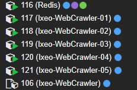

# Ixeo  
  
### Web Crawler  
#### Crawl them public pages  

This crawler runs on Rust. 
It runs fast because there is concurency with redis.

Still in very early stages so nothing more to describe here!

To run the web crawler you can either `Docker compose up` to run Redis and Postgres or host them on your own.

Then `cargo install` probably
Then `cargo watch -x` run to have it rebuild everytime you save the file.